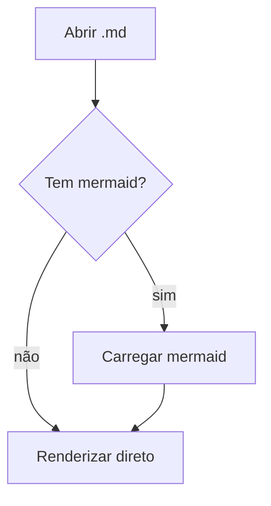

# Documento de demonstração

Este arquivo exercita todos os recursos suportados pelo **MD Reader**.

## Texto e listas

Parágrafo com *itálico*, **negrito**, ~~riscado~~, `código inline` e um
[link externo](https://commonmark.org) que abre no navegador padrão.

- Item de lista
- Outro item
  - Item aninhado
- [x] Tarefa concluída
- [ ] Tarefa pendente

> Citação em bloco para verificar espaçamento e cor.

## Tabela

| Recurso | Status | Observação |
| --- | :---: | --- |
| Tabelas | ✅ | GFM |
| Task lists | ✅ | GFM |
| Mermaid | ✅ | carregado sob demanda |
| KaTeX | ✅ | carregado sob demanda |

## Código

```ts
interface Documento {
  caminho: string
  conteudo: string
}

export function abrir(doc: Documento): string {
  return `${doc.caminho}: ${doc.conteudo.length} caracteres`
}
```

```python
def soma(a: int, b: int) -> int:
    return a + b
```

## Matemática

Inline: $E = mc^2$ e $\sum_{i=1}^{n} i = \frac{n(n+1)}{2}$.

Bloco:

$$
\int_{0}^{\infty} e^{-x^2}\,dx = \frac{\sqrt{\pi}}{2}
$$

## Diagrama válido



## Diagrama inválido (deve mostrar fallback)

```mermaid
graph TD
  A --> ((((
```

## Imagens

Imagem local inexistente (deve degradar sem quebrar):


Imagem remota (deve ficar bloqueada por padrão):


## HTML potencialmente malicioso

<div class="ok"><b>HTML benigno é preservado.</b></div>

<script>alert('xss')</script>

<iframe src="https://exemplo.com"></iframe>

## Unicode

日本語, português com acentuação, emoji 🎉🚀, e uma linha longa para testar a
largura de leitura confortável definida em torno de 70 a 80 caracteres por linha.
