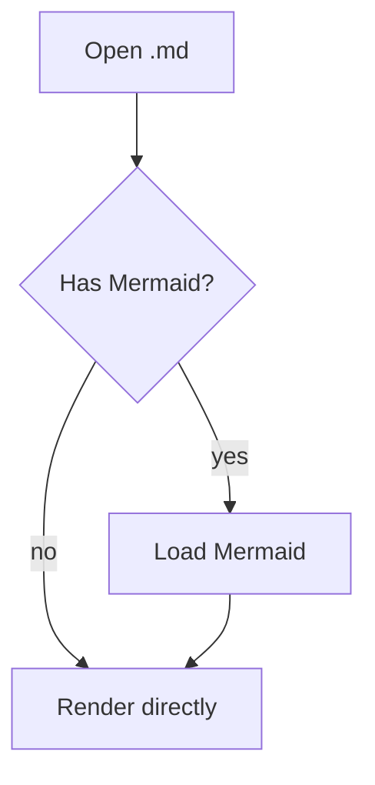

# Demo document

This file exercises every feature supported by **MD Reader**.

## Text and lists

Paragraph with *italic*, **bold**, ~~strikethrough~~, `inline code`, and an
[external link](https://commonmark.org) that opens in the default browser.

- List item
- Another item
  - Nested item
- [x] Completed task
- [ ] Pending task

> Block quote to verify spacing and color.

## Table

| Feature | Status | Notes |
| --- | :---: | --- |
| Tables | ✅ | GFM |
| Task lists | ✅ | GFM |
| Mermaid | ✅ | loaded on demand |
| KaTeX | ✅ | loaded on demand |

## Code

```ts
interface Document {
  path: string
  content: string
}

export function open(doc: Document): string {
  return `${doc.path}: ${doc.content.length} characters`
}
```

```python
def add(a: int, b: int) -> int:
    return a + b
```

## Math

Inline: $E = mc^2$ and $\sum_{i=1}^{n} i = \frac{n(n+1)}{2}$.

Block:

$$
\int_{0}^{\infty} e^{-x^2}\,dx = \frac{\sqrt{\pi}}{2}
$$

## Valid diagram



## Invalid diagram (should show fallback)

```mermaid
graph TD
  A --> ((((
```

## Images

Missing local image (should degrade without breaking):


Remote image (should remain blocked by default):


## Potentially malicious HTML

<div class="ok"><b>Benign HTML is preserved.</b></div>

<script>alert('xss')</script>

<iframe src="https://example.com"></iframe>

## Unicode

日本語, English with accents such as resume and facade, emoji 🎉🚀, and a long line
to test the comfortable reading width set around 70 to 80 characters per line.
